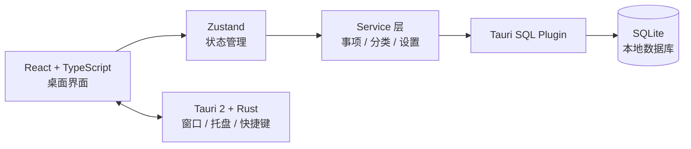

<div align="center">
  

  # 桌面便签

  **一款轻量、透明、数据完全留在本地的 Windows 桌面待办工具。**

  随手记下，安静常驻，需要时一键呼出。

  <p>
    
    
    
    
    
  </p>
</div>

---

## 为什么用它

桌面便签把待办事项放在触手可及的位置，但不会变成另一个需要维护的复杂系统。按下全局快捷键即可呼出窗口，输入内容后按 `Enter` 完成记录；关闭窗口时应用会收进系统托盘，稍后继续使用。

- ⚡ **快速记录**：默认使用 `Ctrl + Alt + Space` 呼出，支持自定义快捷键
- 📌 **始终在手边**：窗口置顶、系统托盘和开机启动按需开启
- 🗂️ **清楚整理**：自定义分类、优先级、截止日期、置顶和拖拽排序
- 🎨 **融入桌面**：暖黄、浅色玻璃、深色玻璃三套主题，透明度自由调节
- 🔎 **专注当下**：按全部、今天、未完成、已完成或自定义类别筛选
- 🔒 **本地优先**：事项、分类、设置和窗口状态均保存在本地 SQLite 数据库
- 📦 **数据可掌控**：通过 JSON 导入或导出全部事项与分类

## 功能一览

| 场景 | 支持能力 |
| --- | --- |
| 记录 | 快速输入、中文输入法兼容、详细备注 |
| 规划 | 分类、三级优先级、截止日期、今天视图 |
| 整理 | 完成/恢复、置顶、同组拖拽排序、批量清空已完成 |
| 桌面体验 | 无边框透明窗口、始终置顶、窗口位置与尺寸记忆 |
| 快速访问 | 全局快捷键、系统托盘、开机启动、启动时隐藏 |
| 个性化 | 暖黄 / 浅色玻璃 / 深色玻璃主题、透明度调节 |
| 数据 | SQLite 本地存储、版本化迁移、JSON 导入导出 |

## 快速开始

### 环境要求

- Windows 10 / 11
- [Node.js](https://nodejs.org/) 20 或更高版本
- [Rust](https://www.rust-lang.org/tools/install) stable 工具链
- Microsoft Edge WebView2 Runtime（Windows 10/11 通常已预装）
- 使用 MSVC 的 Rust 构建环境时，需要 Visual Studio C++ Build Tools

### 本地运行

```powershell
git clone https://github.com/Zengweisong/desktop-sticky-notes.git
cd desktop-sticky-notes
npm ci
npm run tauri dev
```

首次启动时，应用会自动创建本地数据库并执行迁移，无需手动配置数据库。

### 构建 Windows 安装包

```powershell
npm run tauri build
```

NSIS 安装包默认生成在：

```text
src-tauri/target/release/bundle/nsis/
```

## 使用小贴士

1. 按 `Ctrl + Alt + Space` 呼出窗口，也可以在设置中录入新的组合键。
2. 在顶部输入事项，选择类别后按 `Enter` 添加；`Shift + Enter` 可换行。
3. 点击事项的编辑按钮，可以补充备注、优先级和截止日期。
4. 拖动事项左侧手柄可调整顺序。为保持清晰，只能在置顶、未置顶或已完成的同一分组内排序。
5. 点击关闭按钮不会退出应用，而是隐藏到系统托盘；从托盘菜单选择“退出程序”才会完全退出。

## 数据与隐私

桌面便签不依赖账号或云服务，也不会把待办内容上传到远程服务器。数据库由 Tauri SQL 插件保存在系统应用数据目录中，具体位置由操作系统与 Tauri 运行时决定。

升级应用时，数据库通过版本化 migration 自动演进。旧版 `notes.content` 会安全迁移为标题，旧事项会归入“未分类”，不会通过删库重建来升级结构。

建议定期在“设置 → 导出数据”中生成 JSON 备份。导入操作会校验数据格式，并在数据库事务中完成；失败时会自动回滚。

## 技术架构



| 层级 | 技术 | 职责 |
| --- | --- | --- |
| 界面 | React 18、TypeScript、Lucide | 交互、组件和图标 |
| 状态 | Zustand | 事项、分类和设置的前端状态 |
| 样式 | Tailwind CSS、原生 CSS | 主题、透明窗口与动效 |
| 桌面能力 | Tauri 2、Rust | 窗口、系统托盘、快捷键、开机启动 |
| 数据 | SQLite、Tauri SQL Plugin | 本地持久化、事务和结构迁移 |
| 工程 | Vite、Vitest | 开发构建与自动化测试 |

## 项目结构

```text
.
├─ src/
│  ├─ components/      # 界面组件
│  ├─ hooks/           # 业务 hooks
│  ├─ services/        # SQLite 数据访问与导入导出
│  ├─ stores/          # Zustand 状态
│  └─ types/           # TypeScript 类型
├─ src-tauri/
│  ├─ capabilities/    # Tauri 权限配置
│  ├─ src/             # Rust 桌面端与数据库迁移
│  └─ tauri.conf.json  # 窗口和安装包配置
└─ tests/              # 跨模块测试
```

## 开发命令

| 命令 | 用途 |
| --- | --- |
| `npm run tauri dev` | 启动完整桌面应用开发环境 |
| `npm run dev` | 仅启动 Vite 前端开发服务器 |
| `npm run build` | TypeScript 检查并构建前端 |
| `npm test` | 运行 Vitest 测试 |
| `npm run tauri build` | 构建 Windows NSIS 安装包 |

## 参与开发

欢迎提交 Issue 或 Pull Request。开始修改前，请先确保以下检查通过：

```powershell
npm test
npm run build
```

如果修改了 Rust 桌面端代码，再执行：

```powershell
cargo test --manifest-path src-tauri/Cargo.toml
```

---

<div align="center">
  <sub>把事情记下来，然后继续做真正重要的事。</sub>
</div>
